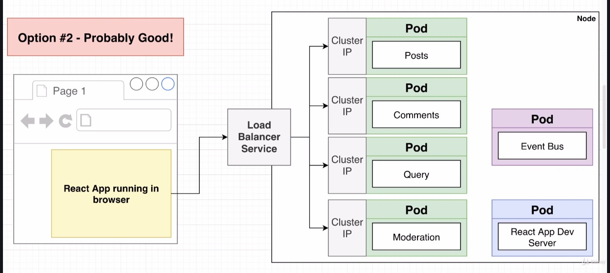

# Blog App With Microservices

> Do not use this project as a template

This code is was done as learning from Stephen Grider's course on Microservices

A basic blog app to grasp the basics of micro-services by making your own implementation of the event bus

## Architecture

## Tech used

- Create React App for frontend
- Node for individual services
- Docker for containers
- Kubernetes for container orchestration
- Skaffold for development
- Nginx Ingress for load balancing
